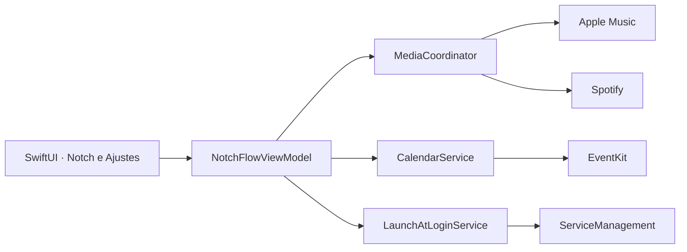

<div align="center">
  

  # NotchFlow

  **Música e calendário no ponto mais natural do seu Mac.**

  [](https://www.apple.com/macos/)
  [](https://www.swift.org/)
  [](https://github.com/Thiagof2755/NotchFlow-swift/actions/workflows/ci.yml)
  [](PRIVACY.md)

  [**Baixar a versão mais recente**](https://github.com/Thiagof2755/NotchFlow-swift/releases/latest/download/NotchFlow-macOS-arm64.zip)

  Aplicativo nativo, leve e sem telemetria para macOS.
</div>

---

## Visão geral

O NotchFlow transforma a área do notch em um painel discreto para controlar o **Apple Music** e o **Spotify**, acompanhar a reprodução e consultar o mês do **Calendário** sem interromper o que você está fazendo.

O painel fica recolhido no topo, abre com uma animação ao aproximar o cursor e funciona de forma independente em todos os monitores conectados.

## O que já está disponível

| Área | Funcionalidades |
| --- | --- |
| Música | Capa, faixa, artista, progresso, play/pause, anterior, próxima e avanço ou retorno de 15 segundos. |
| Fontes | Seleção automática entre Apple Music e Spotify. |
| Calendário | Mês completo, navegação entre meses, marcações nos dias com eventos e resumo do dia selecionado. |
| Monitores | Um notch funcional em cada tela conectada. |
| Sistema | Aplicativo de barra de menus, sem ícone permanente no Dock, com opção de iniciar junto com o Mac. |

## Download e instalação

### Download rápido

Baixe o arquivo **NotchFlow-macOS-arm64.zip** na página de [releases](https://github.com/Thiagof2755/NotchFlow-swift/releases/latest) ou use o botão no início desta página.

> A versão atual é destinada a Macs com Apple Silicon e macOS 14 ou posterior.

### Primeira abertura

1. Descompacte o arquivo baixado.
2. Mova `NotchFlow.app` para a pasta **Aplicativos**.
3. Clique com o botão direito no aplicativo e selecione **Abrir**.
4. Autorize o Calendário e a automação do Apple Music ou Spotify quando o macOS solicitar.
5. No ícone da barra de menus, marque **Abrir ao iniciar o Mac** se quiser inicialização automática.

O build público inicial usa assinatura local ad hoc e ainda não é notarizado pela Apple. Por isso, a primeira abertura pode exigir a confirmação descrita acima.

## Privacidade por padrão

O NotchFlow não possui servidor, conta, banco de dados ou telemetria.

- eventos são lidos diretamente do EventKit e permanecem na memória do Mac;
- títulos de músicas e controles são obtidos por Apple Events;
- nenhuma informação de calendário ou reprodução é enviada pelo NotchFlow;
- a única requisição de rede do aplicativo baixa, por HTTPS, a capa fornecida pelo Spotify;
- capas remotas são limitadas a imagens de até 8 MB e não são salvas em disco.

Consulte [PRIVACY.md](PRIVACY.md) para a descrição completa e [SECURITY.md](SECURITY.md) para relatar uma vulnerabilidade.

## Permissões utilizadas

| Permissão | Motivo | O que o app não faz |
| --- | --- | --- |
| Calendário | Exibir os eventos do mês. | Não cria, altera ou exclui eventos. |
| Automação | Ler e controlar Apple Music e Spotify. | Não executa comandos fornecidos pelo usuário. |
| Item de início | Abrir o próprio aplicativo após o login. | Não instala daemon ou serviço privilegiado. |

## Desenvolvimento

### Requisitos

- macOS 14 ou posterior;
- Xcode 26 ou toolchain Swift 6 compatível;
- Git.

Não são necessários Homebrew, Node.js, chaves do Spotify ou dependências externas de pacote.

### Executar pelo Xcode

1. Abra `Package.swift` no Xcode.
2. Selecione o esquema **NotchFlow**.
3. Pressione `⌘R` para executar e `⌘.` para encerrar.

### Executar pelo terminal

```bash
swift test
swift run NotchFlow
```

### Gerar o aplicativo

```bash
./Scripts/security-check.sh
./Scripts/build-app.sh
```

O pacote será criado em `dist/NotchFlow.app` com ícone, `Info.plist`, permissões mínimas declaradas, hardened runtime e assinatura local ad hoc.

## Arquitetura



Detalhes das responsabilidades, fluxos e decisões técnicas estão em [docs/ARCHITECTURE.md](docs/ARCHITECTURE.md).

## Estrutura do projeto

```text
NotchFlow-swift/
├── Assets/                 # ícone-fonte do aplicativo
├── Configuration/          # Info.plist e entitlements
├── Scripts/                # auditoria e empacotamento local
├── Sources/NotchFlow/      # aplicativo macOS
├── Tests/NotchFlowTests/   # testes de unidade
└── .github/workflows/      # CI e publicação de releases
```

## Roadmap

- aperfeiçoar acessibilidade e navegação por teclado;
- adicionar preferências de aparência e comportamento;
- ampliar testes dos serviços de mídia;
- disponibilizar build universal e notarizado.

## Estado do projeto

O NotchFlow está em desenvolvimento inicial. Use a seção de [Issues](https://github.com/Thiagof2755/NotchFlow-swift/issues) para problemas não sensíveis.

## Licença

Copyright © 2026 Thiago Alves. Todos os direitos reservados. Consulte [LICENSE](LICENSE).
