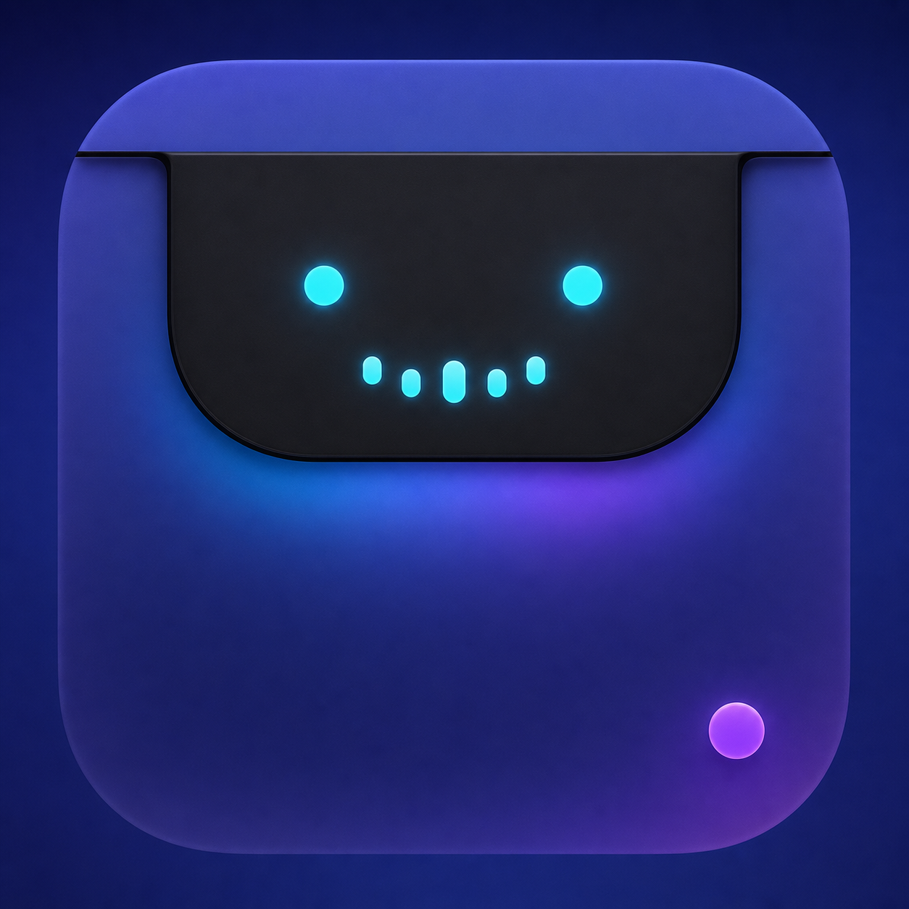
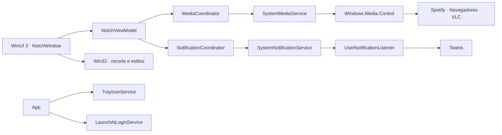

<div align="center">
  

  # NotchFlow para Windows

  **Sua música no ponto mais natural da tela.**

  [](https://www.microsoft.com/windows)
  [](https://dotnet.microsoft.com/)
  [](https://learn.microsoft.com/windows/apps/winui/)
  [](LICENSE)

  Aplicativo nativo, leve e sem telemetria para Windows.
</div>

---

## Visão geral

O NotchFlow põe uma ilha discreta no topo da tela para controlar o que estiver tocando: Spotify,
Apple Music, qualquer aba de navegador com áudio ou vídeo, VLC e outros players.

A ilha fica recolhida no topo, abre com uma animação ao aproximar o cursor e funciona de forma
independente em todos os monitores. Na tela principal ela aparece como uma ilha; nas demais fica
apenas uma tira fina, que abre o painel ao passar o mouse.

Esta é a versão Windows do [NotchFlow para macOS](https://github.com/Thiagof2755/NotchFlow-swift),
de Thiago Alves. O código Swift original continua neste repositório, em `macos/`, como
referência da arquitetura e do desenho.

## O que já está disponível

| Área | Funcionalidades |
| --- | --- |
| Música | Capa, faixa, artista, progresso, play/pause, anterior, próxima e avanço ou retorno de 15 segundos. |
| Fontes | Qualquer player registrado no Windows: Spotify, Apple Music, VLC, foobar2000, MusicBee e outros. |
| Navegador | YouTube, YouTube Music, SoundCloud, Spotify Web e qualquer site com `mediaSession`, no Edge, Chrome, Firefox, Brave, Opera e Vivaldi. |
| Notificações | Indicador persistente do Teams na ilha, com contador, e a lista de quem escreveu no painel. Desligado por padrão. |
| Monitores | Ilha na tela principal e tira discreta nas demais, com painel independente em cada uma. |
| Controles | Barra de progresso arrastável, além dos saltos de 15 segundos. |
| Sistema | Aplicativo residente, sem janela e fora do Alt+Tab, com ícone na bandeja e opção de iniciar junto com o Windows. |

Os controles disponíveis acompanham o que cada player declara: um serviço que não permite pular
faixa deixa esses botões esmaecidos, em vez de oferecer uma ação que não funciona.

## Notificações do Teams

A ilha acompanha as notificações do Teams e mostra um indicador discreto com o número de
mensagens esperando. Ao passar o mouse, o painel lista quem escreveu e a prévia.

**A ilha não se abre sozinha por padrão**, e isso é deliberado. O Windows já mostra um toast
para a mesma mensagem, e abrir a ilha por cima duplicaria o aviso no ponto mais chamativo da
tela. O que a ilha faz que o toast não faz é *permanecer*: o toast some e você perde, o
indicador fica até você ler no Teams, e some sozinho quando você lê.

Quem preferir o outro comportamento pode ligar **Abrir a ilha ao receber** no menu da bandeja:
a ilha abre por 5 segundos e recolhe. Se você levar o mouse até ela nesse intervalo, ela para
de se fechar e passa a obedecer o hover.

### Para ativar

1. Botão direito no ícone da bandeja, marque **Notificações do Teams na ilha**.
2. Autorize o NotchFlow quando o Windows pedir, em Privacidade e Segurança, Notificações.
3. No Teams, em Configurações, Notificações, escolha o estilo **Windows**. Com o estilo interno
   do Teams as mensagens não passam pelo sistema e nada é visto.

O recurso vem desligado porque a permissão é ampla, como explicado abaixo.

## O que ainda não existe

**O painel do calendário.** Na versão macOS ele lê o EventKit, que agrega todas as contas do
sistema com uma permissão local e nenhuma requisição de rede. O Windows não tem equivalente com
as mesmas propriedades:

- `Windows.ApplicationModel.Appointments` depende do app Mail e Calendário, descontinuado em
  favor do novo Outlook;
- o Microsoft Graph funciona bem, mas exige OAuth e acesso à rede, o que quebraria a promessa de
  não ter servidor nem conta;
- um arquivo `.ics` local ou CalDAV preserva a privacidade, mas exige configuração manual.

É uma decisão de produto em aberto, não uma limitação técnica. A geometria da ilha já prevê a
coluna extra: quando o painel existir, ela abre sem que o resto mude.

## Download e instalação

1. Baixe e descompacte o pacote em uma pasta de sua preferência.
2. Execute `NotchFlow.exe`.
3. Para iniciar junto com o Windows, clique com o botão direito no ícone da bandeja e marque
   **Abrir com o Windows**.

Não há instalador, serviço nem tarefa agendada. Para remover, encerre pelo menu da bandeja,
desmarque o início automático e apague a pasta.

> Na primeira execução o Windows costuma esconder ícones novos da bandeja. Se não encontrar o
> ícone, clique na seta de ícones ocultos, ao lado do relógio.

### Requisitos

- Windows 10 versão 1809 ou posterior, ou Windows 11;
- [Windows App Runtime 1.8](https://learn.microsoft.com/windows/apps/windows-app-sdk/downloads).

Para dispensar o runtime, gere um pacote autocontido com `./Scripts/build.ps1 -SelfContained`.

## Privacidade por padrão

O NotchFlow não possui servidor, conta, banco de dados ou telemetria.

- os metadados de mídia vêm do próprio Windows, pelo SMTC, e permanecem em memória;
- as capas chegam prontas do sistema, sem download pela rede;
- **o aplicativo não faz nenhuma requisição de rede**;
- o log local registra apenas eventos do próprio aplicativo, nunca o que você ouviu nem quem
  lhe escreveu;
- as preferências ficam em `%APPDATA%\NotchFlow\settings.json`.

## Permissões utilizadas

| Permissão | Quando | O que o app faz |
| --- | --- | --- |
| Nenhuma | Mídia e início automático | O SMTC é uma API pública sem consentimento, e o início automático usa a chave `Run` do usuário, sem privilégio de administrador. |
| Acesso às notificações | Só se você ligar as notificações do Teams | Leitura local, sem rede. |

Para mídia, isso continua sendo uma vantagem sobre a versão macOS, que precisa de autorização de
Automação para cada player e da opção "Permitir JavaScript de Apple Events" nos navegadores.

### Sobre o acesso às notificações

Vale ser direto: a API do Windows **não permite pedir só o Teams**. A permissão dá acesso às
notificações de todos os aplicativos, inclusive banco e e-mail pessoal.

O que o NotchFlow faz com isso:

- o filtro por aplicativo é aplicado **durante a leitura**, em
  [`NotificationSourceCatalog`](windows/src/NotchFlow.Core/Notifications/NotificationSourceCatalog.cs).
  O que não for do Teams é descartado antes de virar um objeto em memória;
- nada é gravado em disco, nem no log;
- nada sai da máquina, porque o aplicativo não acessa a rede;
- o recurso vem **desligado**, e ligá-lo é uma escolha explícita no menu da bandeja.

Ainda assim, é uma permissão ampla. Se isso incomodar, deixe o recurso desligado: o resto do
NotchFlow funciona sem ele.

## Desenvolvimento

### Requisitos

- .NET SDK 9 ou posterior;
- Windows SDK 10.0.26100;
- Git.

Não são necessários Visual Studio, workloads adicionais nem chaves de API.

Todos os comandos abaixo rodam a partir da pasta `windows/`.

### Compilar e executar

```bash
dotnet run --project src/NotchFlow.App/NotchFlow.App.csproj -c Release
```

### Testes

```bash
dotnet test NotchFlow.sln
```

### Gerar o pacote

```bash
./Scripts/build.ps1
```

O script roda os testes antes de empacotar e publica o SHA-256 do resultado em `windows/dist/`.

## Arquitetura



Três projetos: `NotchFlow.Core` concentra os modelos e o acesso ao SMTC sem depender de XAML, o
que o torna testável; `NotchFlow.App` é o aplicativo WinUI 3; `NotchFlow.Core.Tests` cobre a
lógica pura.

Detalhes das decisões, e o que mudou em relação ao macOS, estão em
[windows/docs/ARCHITECTURE.md](windows/docs/ARCHITECTURE.md).

## Estrutura do repositório

As duas implementações vivem lado a lado, cada uma autocontida:

```text
NotchFlow-Win/
├── windows/                       # a versão Windows, o produto deste repositório
│   ├── NotchFlow.sln
│   ├── src/NotchFlow.Core/        # modelos, SMTC e seleção de fonte
│   ├── src/NotchFlow.App/         # aplicativo WinUI 3
│   ├── tests/NotchFlow.Core.Tests/
│   ├── Scripts/build.ps1          # empacotamento local
│   └── docs/ARCHITECTURE.md
├── macos/                         # a versão Swift original, mantida como referência
│   ├── Package.swift
│   ├── Sources/ · Tests/ · Configuration/ · Scripts/
│   └── docs/ARCHITECTURE.md
└── Assets/                        # ícone, compartilhado pelas duas
```

## Roadmap

- decidir e implementar a fonte do calendário;
- janela de ajustes, hoje substituída pelo menu da bandeja;
- preferências de aparência;
- aperfeiçoar acessibilidade e navegação por teclado.

## Licença

Distribuído sob a [licença MIT](LICENSE), como o projeto original.
