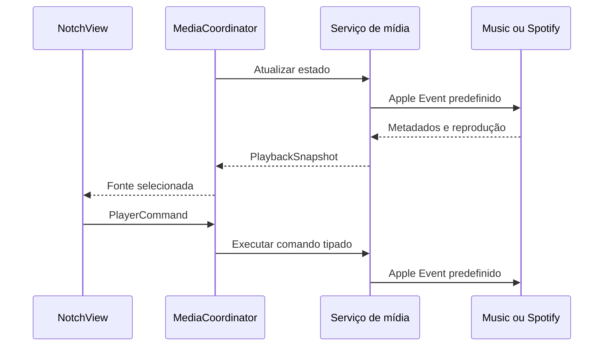

# Arquitetura do NotchFlow

## Objetivos

O projeto prioriza uma interface pequena, integração nativa com o macOS, ausência de infraestrutura externa e separação clara entre apresentação, estado e serviços do sistema.

## Componentes

| Componente | Responsabilidade |
| --- | --- |
| `NotchFlowApp` | Ciclo principal do SwiftUI, menu da barra e janela de Ajustes. |
| `AppDelegate` | Inicialização e encerramento dos serviços compartilhados. |
| `NotchWindowController` | Cria, posiciona e remove um painel por monitor. |
| `NotchFlowViewModel` | Estado de expansão, dimensões e serviços usados pela interface. |
| `MediaCoordinator` | Atualização, seleção da fonte ativa e execução dos comandos de mídia. |
| `AppleMusicService` | Consulta e controla o Apple Music por Apple Events. |
| `SpotifyService` | Consulta e controla o Spotify e carrega capas remotas de forma restrita. |
| `BrowserMediaService` | Encontra a aba com mídia nos navegadores compatíveis e a controla por JavaScript fixo. |
| `BrowserCatalog` | Lista navegadores suportados e serviços reconhecidos, com as capacidades de cada um. |
| `BrowserAppleScript` | Monta os scripts de varredura e de comando enviados aos navegadores. |
| `NotchGeometry` | Valor puro com o tamanho fechado, o tamanho expandido e o recuo superior de cada tela. |
| `AppSettings` | Interruptores do usuário guardados no UserDefaults. |
| `NotchAnimation` | Tempos da abertura e do fechamento, incluindo a espera entre a forma e o conteúdo. |
| `CalendarService` | Solicita permissão e consulta eventos mensais pelo EventKit. |
| `LaunchAtLoginService` | Registra o aplicativo principal como item de início pelo ServiceManagement. |

## Fluxo de mídia

Os comandos possíveis são definidos por `PlayerCommand`. Nenhum texto fornecido pelo usuário é interpolado no AppleScript.

## Fluxo do navegador

1. O serviço lista os navegadores em execução e coloca o que está em primeiro plano na frente.
2. Um único Apple Event lê os endereços de todas as abas. Somente as abas de hosts conhecidos recebem JavaScript, com um limite por varredura.
3. O JavaScript devolve um JSON com os metadados de `navigator.mediaSession`, ou o título do documento quando o site não fornece metadados, além da posição e da duração do elemento de mídia.
4. A aba escolhida fica memorizada e passa a ser consultada diretamente, evitando novas varreduras.
5. Os comandos agem no elemento de mídia da aba. Faixa anterior e próxima usam os botões do próprio site, então só ficam ativos nos serviços que os têm.

Todo o JavaScript é constante do aplicativo, escrito sem aspas duplas e sem barras invertidas, e os únicos valores interpolados nos scripts são identificadores de bundle e índices numéricos de janela e aba. Quando o navegador recusa a automação ou o JavaScript por Apple Events, o serviço para de tentar naquele navegador e mostra a orientação correspondente.

## Fluxo do Calendário

O `CalendarService` consulta apenas o intervalo do mês exibido. Os objetos do EventKit são convertidos para modelos imutáveis usados pela interface. Não existe chamada de criação, alteração ou remoção de evento.

## Abertura e fechamento

A forma e o conteúdo são animados em etapas separadas, controladas por `NotchFlowViewModel.setExpanded(_:)`:

1. Ao abrir, `isExpanded` muda primeiro e a forma cresce. Depois de `NotchAnimation.contentInDelay`, `showsContent` liga e o interior aparece.
2. Ao fechar, `showsContent` desliga primeiro. Depois de `NotchAnimation.shapeCloseDelay`, `isExpanded` volta a falso e a forma encolhe.

A tarefa que faz a segunda etapa é cancelada em cada nova chamada, então movimentos rápidos do cursor não deixam a interface em um estado intermediário.

## Múltiplos monitores

O `NotchWindowController` mantém um contexto por identificador de display. Cada contexto possui seu próprio estado de expansão e compartilha os serviços de mídia e calendário, evitando consultas duplicadas.

O tipo de tela vem de `CGDisplayIsBuiltin`. Na tela do Mac a ilha fechada acompanha o notch de hardware. Em monitores externos, com a preferência ativa, ela fica reduzida a uma tira de 132 por 9 pontos que abre o painel ao passar o mouse ou clicar.

## Permissões e assinatura

O calendário é solicitado uma vez por sessão, automaticamente, quando o estado é indeterminado. O macOS associa a permissão à assinatura do aplicativo: com assinatura ad hoc, cada build vira um aplicativo diferente e o pedido reaparece. `Scripts/build-app.sh` aceita `NOTCHFLOW_SIGN_IDENTITY` para assinar com um certificado fixo e preservar as permissões entre builds.

## Persistência

O aplicativo guarda apenas dois interruptores no UserDefaults, em `AppSettings`: a integração com o navegador e a redução em telas externas. A configuração de início automático pertence ao macOS. Metadados, eventos e capas permanecem somente em memória.

## Build

`Scripts/build-app.sh` executa testes, produz o binário de release, gera o `.icns`, monta a estrutura do bundle, valida o `Info.plist` e aplica hardened runtime com assinatura ad hoc. O workflow de release empacota o aplicativo e publica também o SHA-256 do download.
