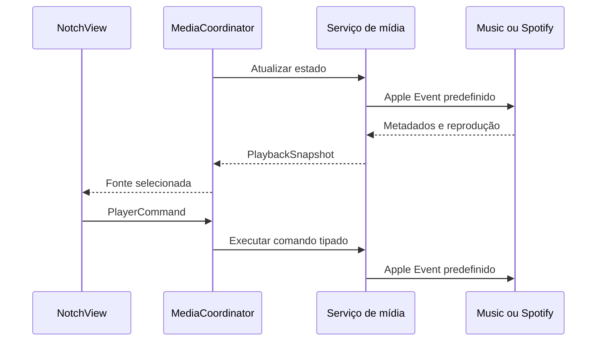

# Arquitetura do NotchFlow

## Objetivos

O projeto prioriza uma interface pequena, integração nativa com o macOS, ausência de infraestrutura externa e separação clara entre apresentação, estado e serviços do sistema.

## Componentes

| Componente | Responsabilidade |
| --- | --- |
| `NotchFlowApp` | Ciclo principal do SwiftUI, menu da barra e janela de Ajustes. |
| `AppDelegate` | Inicialização e encerramento dos serviços compartilhados. |
| `NotchWindowController` | Cria, posiciona e remove um painel por monitor. |
| `NotchFlowViewModel` | Estado de expansão, dimensões e serviços usados pela interface. |
| `MediaCoordinator` | Atualização, seleção da fonte ativa e execução dos comandos de mídia. |
| `AppleMusicService` | Consulta e controla o Apple Music por Apple Events. |
| `SpotifyService` | Consulta e controla o Spotify e carrega capas remotas de forma restrita. |
| `CalendarService` | Solicita permissão e consulta eventos mensais pelo EventKit. |
| `LaunchAtLoginService` | Registra o aplicativo principal como item de início pelo ServiceManagement. |

## Fluxo de mídia

Os comandos possíveis são definidos por `PlayerCommand`. Nenhum texto fornecido pelo usuário é interpolado no AppleScript.

## Fluxo do Calendário

O `CalendarService` consulta apenas o intervalo do mês exibido. Os objetos do EventKit são convertidos para modelos imutáveis usados pela interface. Não existe chamada de criação, alteração ou remoção de evento.

## Múltiplos monitores

O `NotchWindowController` mantém um contexto por identificador de display. Cada contexto possui seu próprio estado de expansão e compartilha os serviços de mídia e calendário, evitando consultas duplicadas.

## Persistência

O aplicativo não possui persistência própria. A configuração de início automático pertence ao macOS. Metadados, eventos e capas permanecem somente em memória.

## Build

`Scripts/build-app.sh` executa testes, produz o binário de release, gera o `.icns`, monta a estrutura do bundle, valida o `Info.plist` e aplica hardened runtime com assinatura ad hoc. O workflow de release empacota o aplicativo e publica também o SHA-256 do download.
